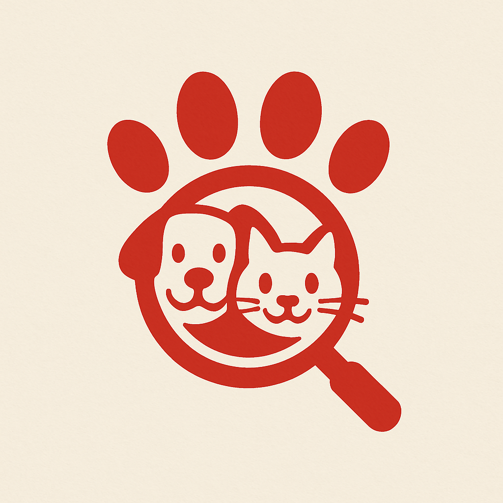
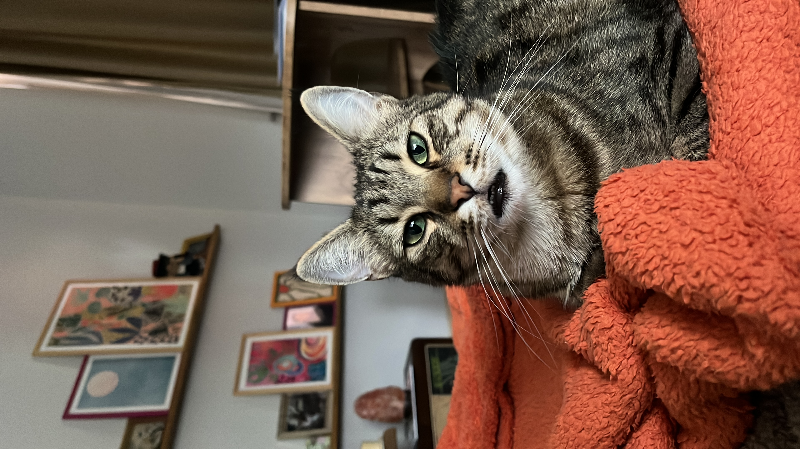

  
  <h1><samp>Buldum App</samp></h1>
  <samp>
  
  $\color{WildStrawberry}{Buldum}$ Application Repository
  </samp>
    
  

    
  
  
  

  

## Project Introduction

### Project Description and Main Purpose

`Buldum App`, is an application that make people able to create `posters` about their missing pets and view other `posters` based on `location`. `Users` will be able to `comment` for each missing `poster` with the comment tags like `found it`, `seen it` with a relevant `location information` etc.

`Posters` will be listed like `news feed` on the main screen on the `mobile application` main page of the `website`. People might just slide them like to see all `missing posters` on their/ preffered location or will be able to filter `posters` based on the given information on `poster`. `Posters` will have statuses to indicate whether the action is done by somehow or it continues. `Poster comments` will be shown always in date order ascending way to show last comment in last place.

`Users` will be able to `comment` their own or others' `posters`. However, there will be a `rate limiting` on a user commenting on same post. `Users` will be able to choose whether the `poster owner` or other users can contact with them via their contact information. Any kind of `1 to 1` communication will not be supported over the `Buldum App`.

> [!NOTE]
> We are (for now just me) planning to serve this application for `free` since it is not a good behavior to earn money from people's sufferring. However, it might be to necessary to get sponsorship or money support from you guys to cover application's expenses.

 

### Application's People

[Ilker Ciblak](https://github.com/ilkerciblak) | Full Stack Developer

[Turkan Tugce Tufan](https://instagram.com/turkantugcetufan) | Consultant & Lovely Wife

 Luffy | Consultant & Getting Lost Specialist

### Support And Donations

> [!CAUTION]
> This place in under construction 🚧

 

## Business Problem Definition

In this part of the document, we need to discuss about real business requirements and planning techniques that we are going to use to identify business logic of the application. In order to briefly plan real business requirements and not miss any use case, `Domain Driven Design`, `Behavior-Driven Development`, `Event Storming`, `Example Mapping` and `User Story Mapping` techniques will be used.

### Domain Description
